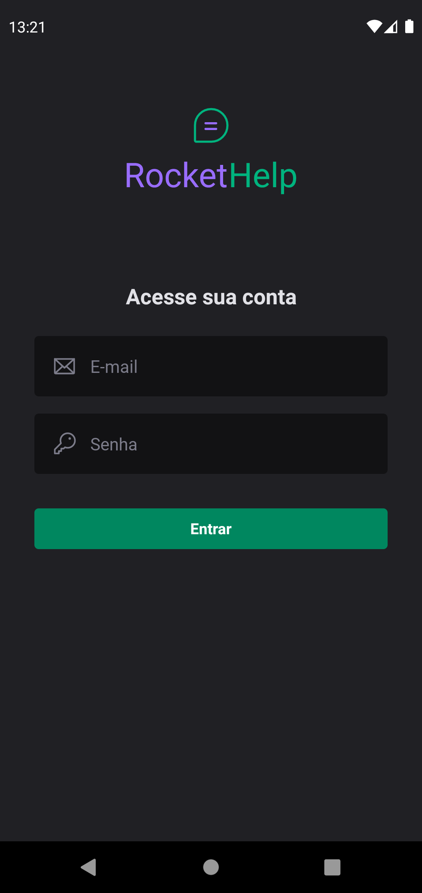
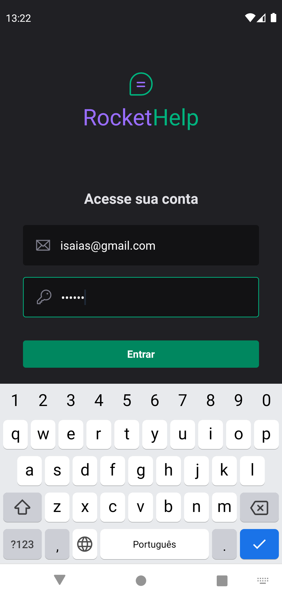
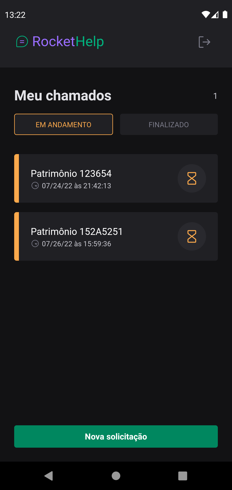
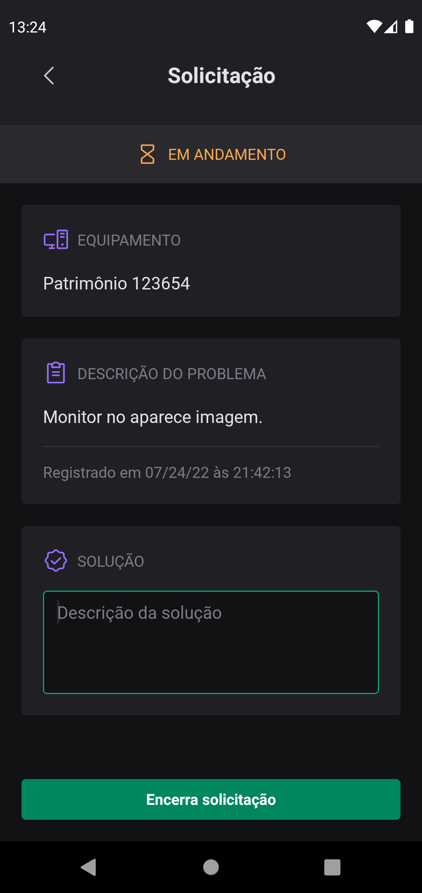
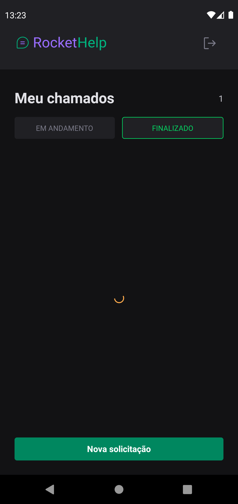
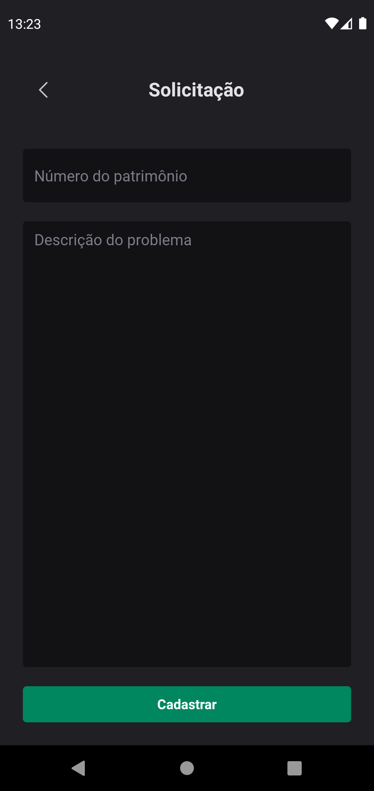

## Projeto AppRocketHelp
A aplicação para gerenciar em tempo real solicitações de manutenção e suporte a equipamentos.

  
  
  
  
  
  
  
  

## Tecnologias
- [x] React Native
- [x] Typescript
- [x] Expo Bare Workflow
- [x] Native Base
- [x] Firebase
- [x] Firebase Auth
- [x] Firebase Firestore com atualizações em tempo real

## Funcionalidades
- [x] Cadastro de usuários
- [x] Autenticação de usuários
- [x] Criar novas solicitações
- [x] Filtra solicitações pelo status
- [x] Encerra solicitação com solução
- [x] Sincronização com banco de dados em tempo real

  <small>Desenvolvido por Isaias Tortorele em conjunto com Rodrigo Gonçalves Santana da Rockeaseat</small>
   
   
   

   
   

